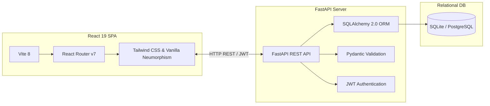

# 🎯 Focus Portal: In-House Goal-Setting and Tracking Portal

Welcome to the **Focus Portal** (In-House Goal-Setting & Tracking Portal). Focus Portal is a modern, high-performance, full-stack enterprise platform designed to streamline organization-wide goal definition, cascading key performance indicators (KPIs), manager approval workflows, and quarterly check-ins.

This system enables a robust **Employee-Manager-HR Admin** relationship structure with premium, responsive, and tactile UI aesthetics.

---

## 🌟 Core System Roles & Capabilities

### 1. 👤 Employee Portal (Phase 1 & Phase 2)
*   **Drafting & Inline Modification**: Create, edit, and draft goal sheets. For any goal in `Draft` or `Rejected` status, employees can edit core parameters (Title, Description, Thrust Area, UoM, Targets) inline inside an accordion-style panel.
*   **Real-Time Sheet Validation**: Real-time checklist panel enforces company compliance criteria before a goal sheet can be submitted for review:
    1.  **Total Weightage Sum**: Across all goals must equal exactly **100%**.
    2.  **Density Limit**: An employee can create a maximum of **8 goals** per year.
    3.  **Minimum Weightage**: The minimum allowed weightage for any individual goal is strictly **10%**.
*   **Pushed Shared KPIs**: Receive Departmental KPIs assigned by Admins or Managers. These shared goals allow *Limited Editing*: Goal Title, Targets, and Thrust Areas are read-only; employees may only adjust their local weightage and add execution notes.
*   **Achievement Logging & Status Updates**: Log actual achievements against planned targets and update goal states (`Not Started`, `On Track`, `Completed`) during quarterly check-in windows.
*   **Goal Locking**: Once a sheet is approved, core objectives lock immediately to prevent unauthorized modification.

### 2. 👥 Manager Portal
*   **Centralized Team Dashboard**: Track the real-time performance, completion rates, and goal-sheet statuses of all direct reports in one unified interface.
*   **Goal Sheet Approval Workflow**: Review team goal sheets with the option to inline-edit weightages or targets, return the sheets to direct reports for rework with structured comments, or officially approve and lock them.
*   **KPI Cascading**: Push department-level key performance metrics as "Shared Goals" to multiple employees simultaneously.
*   **Quarterly Reviews**: Provide structured feedback and check-in evaluations during designated check-in review windows.

### 3. 🔑 HR Admin Portal
*   **User & Hierarchy Management**: Track reporting relationships (direct reports/reporting managers) and manage core employee-manager mappings.
*   **KPI & Master Definition Control**: Define standard "Thrust Areas", configure departmental master KPIs, and cascade them globally.
*   **Global Administrative Control**: Intervene to unlock locked goals for adjustments, reset password credentials, and view organization-wide completion reports.

---

## 🛠️ Architecture & Tech Stack



### Backend (Python)
*   **Framework**: FastAPI for fast, asynchronous endpoints.
*   **ORM**: SQLAlchemy 2.0 (with async capabilities).
*   **Database**: PostgreSQL (via `asyncpg`) or SQLite for light, local development.
*   **Security & Auth**: JWT-token based security (via `python-jose` and `passlib[bcrypt]`).
*   **Validation**: Pydantic v2 schemas and validation settings.

### Frontend (JavaScript/React)
*   **Scaffolding**: Vite 8 (Hot Module Replacement, fast bundle builds).
*   **Library**: React 19.
*   **Styling**: Modern, elegant, curated color palettes, tailored glassmorphism, dynamic micro-animations, and custom neumorphic layout shadows.
*   **Routing**: React Router DOM v7.
*   **Icons**: Lucide React.

---

## 🚀 Getting Started

### Prerequisites
*   [Python 3.10+](https://www.python.org/downloads/)
*   [Node.js 18+](https://nodejs.org/)

### 1. Backend Setup & Configuration
1.  Navigate to the backend directory:
    ```bash
    cd backend
    ```
2.  Create and activate a Python virtual environment:
    ```bash
    python -m venv venv
    # Windows:
    .\venv\Scripts\activate
    # macOS/Linux:
    source venv/bin/activate
    ```
3.  Install dependencies:
    ```bash
    pip install -r requirements.txt
    ```
4.  Configure environment variables inside `backend/.env`:
    ```ini
    DATABASE_URL=sqlite+aiosqlite:///./goals.db
    SECRET_KEY=your-jwt-signing-secret-key-change-this
    ALGORITHM=HS256
    ACCESS_TOKEN_EXPIRE_MINUTES=480
    ```
5.  Initialize the database schema:
    ```bash
    python init_db.py
    ```
6.  Seed default thrust areas and test user hierarchy:
    ```bash
    python run_seed.py
    python run_shared_kpi_migration.py
    ```
7.  Run the development server:
    ```bash
    uvicorn main:app --reload --port 8000
    ```
    *   API Documentation will be available at `http://127.0.0.1:8000/docs`.

### 2. Frontend Setup & Configuration
1.  Navigate to the frontend directory:
    ```bash
    cd ../frontend
    ```
2.  Install dependencies:
    ```bash
    npm install
    ```
3.  Configure local environment variables (if any) or double-check the local API routing configured in `frontend/src/api/`.
4.  Start the Vite local development server:
    ```bash
    npm run dev
    ```
5.  Open your browser and navigate to `http://localhost:5173`.

---

## 🗄️ Database Entity-Relationship Overview

*   **`User`**: Core user accounts. Defines `role` (`Employee`, `Manager`, `Admin`), `reporting_manager_id` (forming the corporate reporting hierarchy tree), and department.
*   **`ThrustArea`**: Top-level corporate priorities (e.g., *Sales & Revenue*, *Product Innovation*, *Customer Excellence*).
*   **`SharedKPI`**: Master departmental KPIs pushed down by admins/managers, which cascade as read-only templates to employee goal sheets.
*   **`Goal`**: Individual employee objectives. Tracks fields like status (`Draft`, `Pending`, `Approved`, `Rejected`), `weight`, `target`, `uom` (numeric, %, timeline, zero-based), and links optionally to a `SharedKPI`.
*   **`GoalTask`**: Granular, action items managed by the employee to track how goals are being executed.
*   **`GoalCheckin`**: Periodic actual progress logged by employees, with corresponding feedback notes and check-in comments added by managers.

---

## 📜 Coding Guidelines & Design Standard
*   **Premium Neumorphic Design**: Tailored shadows (`shadow-[6px_6px_12px_#AEAEC0,-6px_-6px_12px_#FFFFFF]`) and soft gradients are standard. Avoid default plain browser inputs or elements.
*   **No Placeholders**: Always present real-time, functioning widgets or fallback empty states rather than empty text.
*   **Strict Security**: Backend routes dynamically verify user sessions (`current_user`) and strictly check manager-report relationships when reviewing or editing goals.
